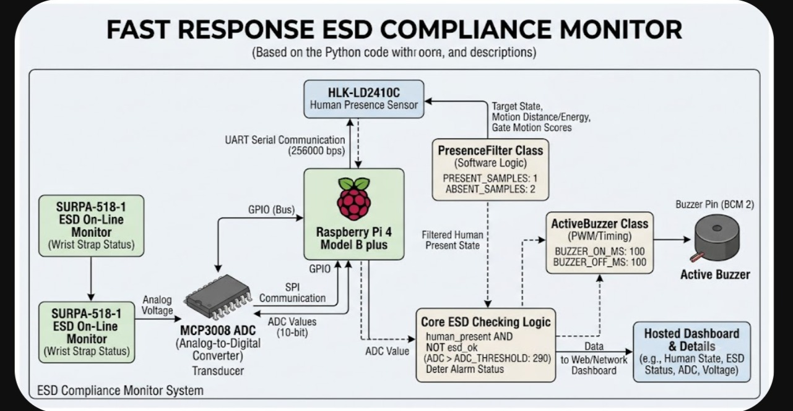
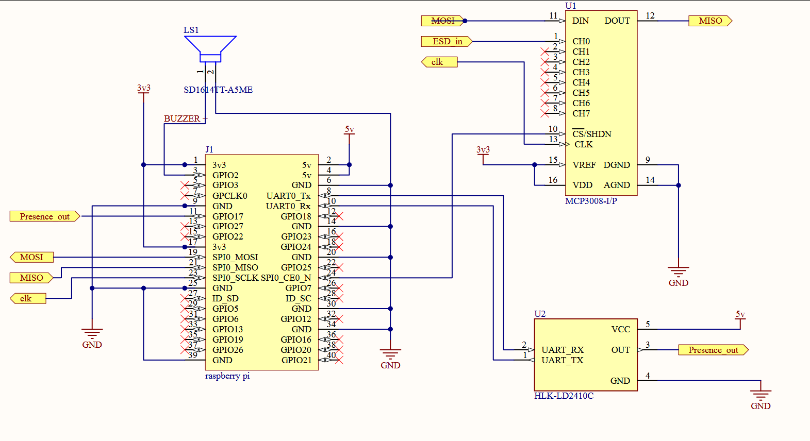

# Fast Response ESD Compliance Monitor

## Overview

The Fast Response ESD Compliance Monitor is a Raspberry Pi-based industrial safety system designed to enforce Electrostatic Discharge (ESD) compliance at electronics assembly and testing workstations.

The system combines human presence detection using the HLK-LD2410C mmWave radar with ESD wrist-strap compliance monitoring. When a person is detected at the workstation and an ESD fault condition exists, an audible alarm is generated to alert the operator.

The system is optimized for low-latency operation and is intended for deployment in electronics manufacturing environments where ESD protection compliance is critical.

---

## Features

* Real-time human presence detection using HLK-LD2410C mmWave radar
* ESD wrist-strap compliance monitoring
* Low-latency fault detection and alarm generation
* Presence filtering to reduce false detections
* Analog signal acquisition through MCP3008 ADC
* Flask-based REST API for remote control
* Automatic LD2410 radar configuration during startup
* Web-based monitoring dashboard
* Systemd service integration
* Request rate limiting
* Raspberry Pi deployment
* Modular software architecture

---

## System Architecture



The system continuously monitors workstation occupancy and ESD compliance status. Presence information from the LD2410C radar and ESD status information from the monitoring circuit are processed by the Raspberry Pi.

If a person is detected and an ESD fault condition exists, the buzzer alarm is activated.

---

## Hardware Schematic



---

## Hardware Design

The Raspberry Pi serves as the central controller and interfaces with all peripherals required for ESD compliance monitoring.

The HLK-LD2410C mmWave radar is connected through a UART interface and is responsible for detecting operator presence at the workstation.

The ESD monitoring circuit generates an analog compliance signal which is sampled by the MCP3008 ADC through SPI. The sampled value is evaluated against a configurable threshold to determine compliance status.

An active buzzer connected to a Raspberry Pi GPIO provides immediate audible feedback whenever a compliance fault is detected while a workstation is occupied.

All hardware interconnections and signal routing are shown in the schematic above.

---

## System Components

| Component              | Function                          |
| ---------------------- | --------------------------------- |
| Raspberry Pi 4 Model B | Main processing unit              |
| HLK-LD2410C            | Human presence detection          |
| MCP3008                | Analog-to-digital converter       |
| Active Buzzer          | Audible alarm indication          |
| ESD Monitor Circuit    | Wrist-strap compliance monitoring |
| Flask Server           | Remote monitoring and control     |

---

## Hardware Interfaces

| Interface    | Connected Device      |
| ------------ | --------------------- |
| UART         | HLK-LD2410C Radar     |
| SPI          | MCP3008 ADC           |
| GPIO         | Active Buzzer         |
| Analog Input | ESD Monitoring Signal |

---

## Hardware Signal Summary

| Signal       | Description                               |
| ------------ | ----------------------------------------- |
| Presence_out | Presence indication output from LD2410C   |
| ESD_in       | Analog compliance signal from ESD monitor |
| MOSI         | SPI data from Raspberry Pi to MCP3008     |
| MISO         | SPI data from MCP3008 to Raspberry Pi     |
| CLK          | SPI clock signal                          |
| Buzzer       | Audible fault indication output           |

---

## Software Architecture

```text
┌──────────────────────────────┐
│      Flask Web Server        │
│                              │
│  /health                     │
│  /status                     │
│  /start                      │
│  /stop                       │
└──────────────┬───────────────┘
               │
               ▼
┌──────────────────────────────┐
│      Application Layer       │
│                              │
│  Presence Detection Filter   │
│  Compliance Engine           │
│  Alarm Controller            │
└──────────────┬───────────────┘
               │
               ▼
┌──────────────────────────────┐
│      Hardware Drivers        │
│                              │
│  LD2410 UART Driver          │
│  MCP3008 SPI Driver          │
│  GPIO Buzzer Driver          │
└──────────────┬───────────────┘
               │
               ▼
┌──────────────────────────────┐
│          Hardware            │
│                              │
│  HLK-LD2410C Radar           │
│  MCP3008 ADC                 │
│  ESD Monitor                 │
│  Active Buzzer               │
└──────────────────────────────┘
```

---

## Detection Logic

### Presence Detection

The HLK-LD2410C radar continuously provides:

* Motion distance
* Motion energy
* Stationary distance
* Stationary energy
* Gate motion energy values

Presence is determined using the motion energy from Gate 0 and Gate 1.

```python
motion_score = (
    gate0_motion +
    gate1_motion
)

human_present = (
    motion_score >
    MOTION_THRESHOLD
)
```

The radar configuration limits detection to Gates 0–2 while occupancy determination uses the combined motion energy from Gate 0 and Gate 1 to prioritize close-range operator detection.

---

## Presence Filtering

To reduce false triggers while maintaining low latency, a lightweight presence filter is applied.

Presence is asserted after:

* 1 consecutive positive detection

Presence is cleared after:

* 2 consecutive negative detections

This provides fast operator detection while preventing rapid state oscillation caused by transient radar measurements.

---

## ESD Compliance Verification

The ESD monitor output is connected to the MCP3008 ADC.

When a person is present, the ADC value is evaluated against a predefined threshold.

```python
esd_ok = (
    adc_value <=
    ADC_THRESHOLD
)
```

If the threshold is exceeded, the workstation is classified as non-compliant.

---

## Alarm Logic

```text
Read Radar Data
       │
       ▼
Human Present ?
    │      │
   No     Yes
    │       │
    ▼       ▼
Alarm OFF  Read ADC
               │
               ▼
      ADC > Threshold ?
           │       │
          No      Yes
           │       │
           ▼       ▼
        ESD OK  ESD Fault
           │       │
           ▼       ▼
      Alarm OFF Alarm ON
```

---

## LD2410 Configuration

The radar is automatically configured during system startup for close-range workstation monitoring.

The configuration includes:

* Engineering mode enabled
* Maximum active gate limited to Gate 2
* 0.2 m gate resolution
* Effective monitoring range of approximately 0.6 m
* Optimized Gate 0 sensitivity
* Optimized Gate 1 sensitivity
* Presence-focused detection profile
* Reduced no-person timeout

Only the nearest radar gates are considered during monitoring. Restricting the active detection region to approximately 0.6 m reduces false triggers caused by nearby personnel, adjacent workstations, and background movement while maintaining reliable operator detection.

---

## Default Configuration Parameters

| Parameter        | Value  |
| ---------------- | ------ |
| UART Baud Rate   | 256000 |
| ADC Channel      | 0      |
| ADC Threshold    | 290    |
| ADC Samples      | 3      |
| Motion Threshold | 25     |
| Presence Samples | 1      |
| Absence Samples  | 2      |
| Loop Delay       | 20 ms  |
| Buzzer ON Time   | 100 ms |
| Buzzer OFF Time  | 100 ms |

---

## Service Management

The monitoring application is designed to run as a Linux systemd service.

Service Name:

```text
esd-monitor
```

The Flask control server can:

* Start the monitoring service
* Stop the monitoring service
* Query service status

using standard systemctl commands executed locally on the Raspberry Pi.

---

## REST API

### Health Check

```http
GET /health
```

Response:

```json
{
  "status": "healthy",
  "service": "esd-control-server"
}
```

### Service Status

```http
GET /status
```

Returns the current monitoring service state.

### Start Monitoring

```http
POST /start
```

Required Header:

```http
X-API-KEY: <configured-api-key>
```

### Stop Monitoring

```http
POST /stop
```

Required Header:

```http
X-API-KEY: <configured-api-key>
```

---

## Web Dashboard

A lightweight browser-based dashboard is provided for remote monitoring and control.

Features:

* View monitoring service status
* Start monitoring service
* Stop monitoring service
* API health monitoring
* Automatic status refresh

The dashboard communicates with the Flask REST API and displays real-time service information.

---

## Security Features

* API key protected control endpoints
* Request rate limiting using Flask-Limiter
* Service isolation through systemd
* Local network deployment support

> Note: The current implementation uses a static API key intended for demonstration and internal deployment. Production deployments should replace this with a more robust authentication mechanism.

---

## Project Structure

```text
Fast-Response-ESD-Monitor/
│
├── compliance.py
├── server.py
│
├── templates/
│   └── main.html
│
├── static/
│   └── style.css
│
├── architecture.jpeg
├── schematic.png
│
├── README.md
├── requirements.txt
└── LICENSE
```

---

## Installation

### Clone Repository

```bash
git clone https://github.com/The-Parzival-OFFICIAL/esd_compliance_detection_device.git

cd esd_compliance_detection_device
```

### Install Dependencies

```bash
sudo apt update

sudo apt install python3-pip

pip install -r requirements.txt
```

Example requirements:

```text
pyserial
spidev
RPi.GPIO
flask
flask-limiter
```

---

## Running the Compliance Monitor

```bash
python3 compliance.py
```

---

## Running the Control Server

```bash
python3 server.py
```

The web interface will be available at:

```text
http://<raspberry-pi-ip>:8008
```

---

## Example Output

### Normal Operation

```text
Human=YES | Dist=45cm | G0=34 | G1=29 | ADC=250.3 | V=0.81V | ESD=OK
```

### ESD Fault Condition

```text
Human=YES | Dist=48cm | G0=39 | G1=33 | ADC=365.8 | V=1.18V | ESD=FAULT
```

---

## Troubleshooting

### No Radar Data Received

Verify:

* UART wiring
* UART baud rate configuration
* Radar power supply
* LD2410 startup configuration

### ADC Reading Always Zero

Verify:

* MCP3008 SPI connections
* SPI interface enabled on Raspberry Pi
* ESD monitor output wiring

### Alarm Does Not Activate

Verify:

* Buzzer wiring
* GPIO configuration
* ADC threshold configuration
* Human presence detection status

### Frequent False Alarms

Verify:

* ESD monitor calibration
* Motion threshold configuration
* Radar mounting position
* Nearby sources of interference

---

## Applications

* Electronics manufacturing
* PCB assembly lines
* Electronics testing laboratories
* ESD protected workstations
* Industrial production environments
* Quality assurance stations

---

## Design Decisions

### Why mmWave Radar Instead of PIR?

Traditional PIR sensors cannot reliably detect stationary operators. The HLK-LD2410C provides both motion and stationary presence detection, making it more suitable for workstation occupancy monitoring.

### Why Presence-Gated ESD Monitoring?

Continuous alarm generation when a workstation is unoccupied would create nuisance alarms. Presence gating ensures alarms are only generated when an operator is present.

### Why Limit Detection to Gate 2?

The objective of the system is to monitor the operator actively using the workstation rather than nearby personnel.

By restricting detection to the first three radar gates and configuring a 0.2 m gate resolution, the effective monitoring region is reduced to approximately 0.6 m from the sensor.

This minimizes false detections caused by movement in surrounding workstations and improves alarm reliability.

### Why Use Motion Energy from Gate 0 and Gate 1?

The nearest gates correspond to the operator's working area. Using only these gates prioritizes close-range occupancy detection while reducing interference from reflections and movement outside the workstation.

### Why Use an MCP3008 ADC?

The Raspberry Pi does not include native analog inputs. The MCP3008 provides a simple and reliable method of sampling the analog ESD compliance signal.

### Why a Fast 20 ms Monitoring Loop?

A short monitoring interval minimizes fault response time and allows near real-time alarm generation.

---

## Future Improvements

* Event logging
* Historical compliance reports
* Database integration
* MQTT support
* Email notifications
* SMS alerts
* Multi-workstation deployment
* Grafana dashboard integration
* Cloud monitoring support

---

## My Contributions

During the internship I contributed to:

* Integration of the HLK-LD2410C mmWave radar
* Development of workstation presence detection logic
* MCP3008 ADC interfacing and signal acquisition
* ESD compliance evaluation algorithm
* Audible fault notification system
* Flask REST API implementation
* Web dashboard development
* Systemd service integration
* System integration and validation testing
* Hardware bring-up and debugging
* Technical documentation

---

## Author

THE-Parzival-OFFICIAL

Electronics and Communication Engineering

Embedded Systems | IoT | Industrial Automation

---

## License

This project is licensed under the MIT License.

See the LICENSE file for additional details.
